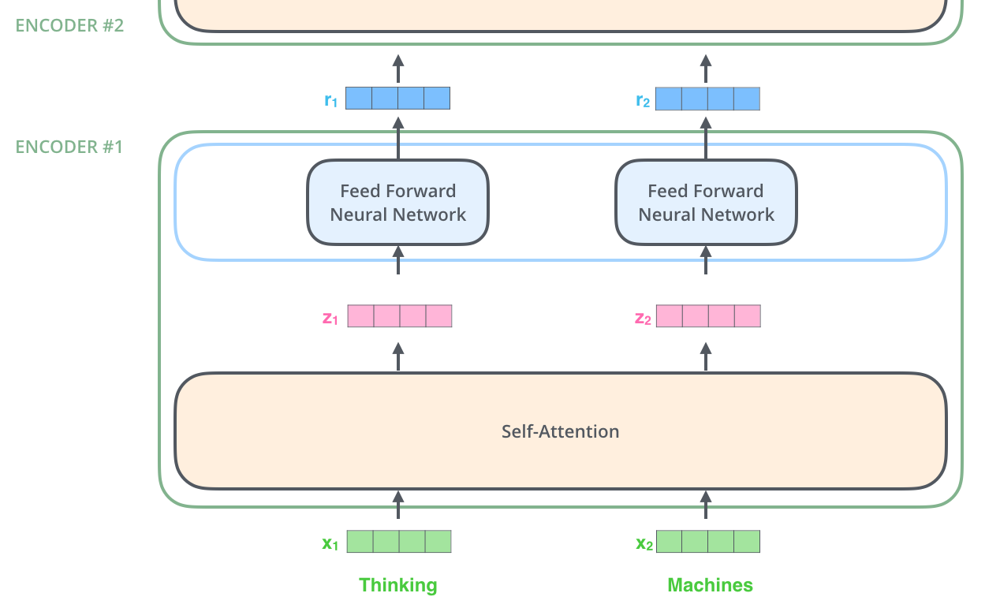
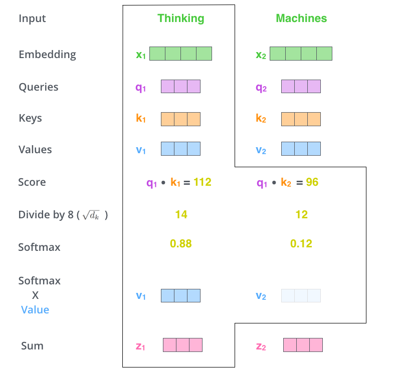
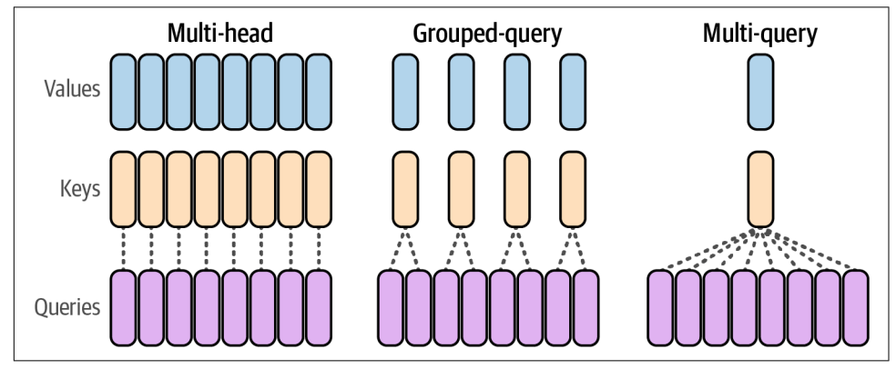
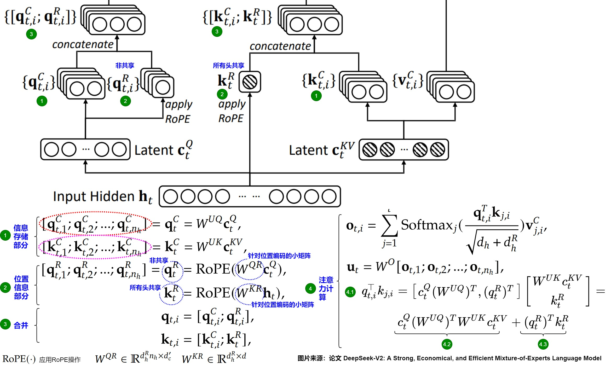
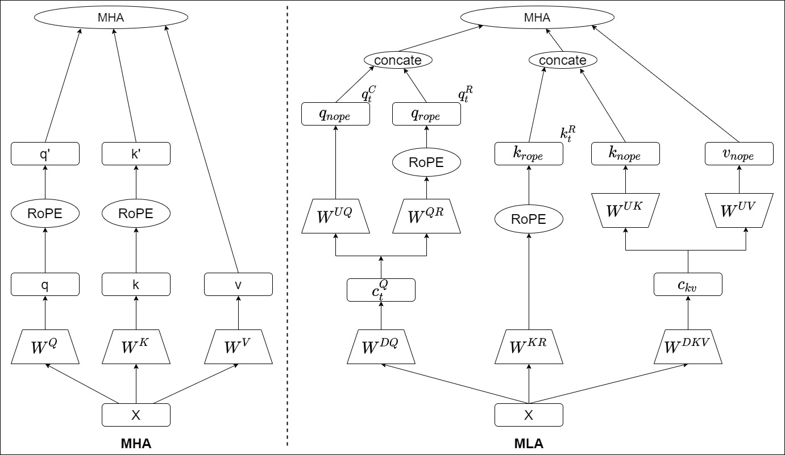
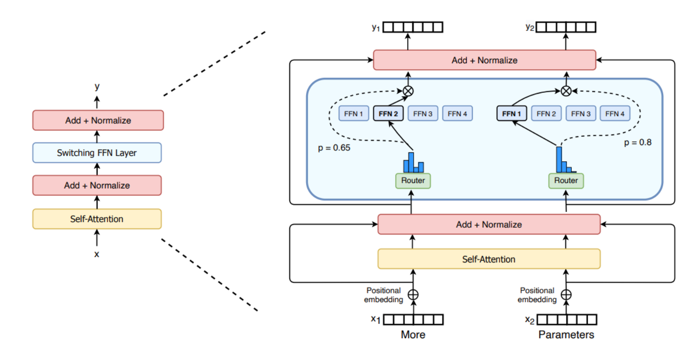
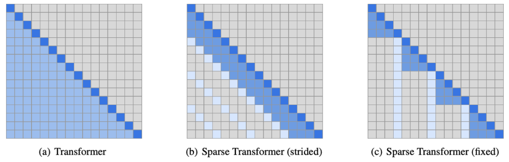
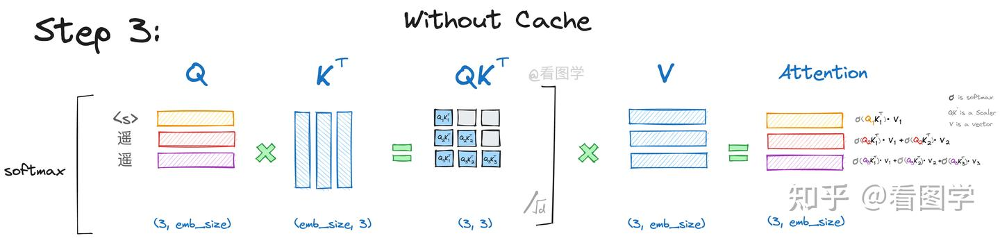
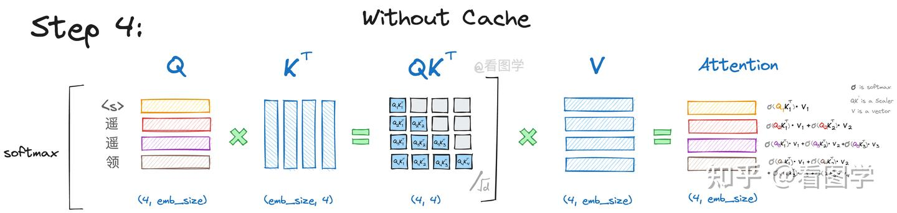

最近好久没看Attention算法相关的论文了，简单记录一下现在比较流行的LLM推理技术和各种Attention变体
# Attention算法
## 基础算法
不多说，经典公式
$$
\text{Attention}(Q, K, V) = \text{softmax}\left(\frac{QK^\top}{\sqrt{d_k}}\right)V
$$

理解推荐[这篇文章](https://jalammar.github.io/illustrated-transformer/)的解析, 下面只简要介绍：

以encoder为例

每个词都会被编码成embeddings，依次经过self-attention，和FFN。在attention阶段会有依赖，但在FFN可以每个词并行。

QK相乘，计算注意力分数，$\sqrt{d_k}$是为了稳定梯度，softmax转换为概率后乘以V，可以理解为“减少不重要单词的权重”，注意在矩阵计算中，softmax是按行做的，意思是对每个Q，计算其对其他词的注意力分数。这也为KVCache提供了空间。

实际计算中以矩阵形式实现：
$$
\text{softmax}\left(\frac{Q_{L\times d}K^\top_{L\times d}}{\sqrt{d_k}}\right)V_{L\times d}
$$
$$
Q, K, V_{L\times d} = X_{L\times E} \times W^{Q/K/V}_{E\times d}
$$
其中$E$为Embedding长度，$N$为序列长度，$d$为隐藏层大小，$d_k$为key向量的维度。这里精妙的地方就在于，QKV和输出都是以$L \times d$大小算的，在Self-Attention，MHA，GQA中也是这个大小。

在实际场景中，每个输入词嵌入会被加一个位置编码X = X + Pos，element-wise相加就行。

在原始的Bert论文中，有Encoder和Decoder两部分，这俩可以一起用，也可以分开用。Encoder用来分析文本，每个词的注意力可以和之前的词做注意力，比如BERT（Representation Models）。Decoder-only比如GPT，用于生成文本（Generative Models），每个词的注意力只能和自己之前的词（已知的）做，可以通过在QK相乘结束的softmax之前做mask实现。

这图里也很明显，Decoders的输出也是$L \times d$的大小，最后影射到一个单词是最后的Linear来做的。

## MHA, MQA, GQA

本质是KV矩阵的数量不同
- MHA，每个Head都有自己的$W^{Q/K/V}$, 和X相乘，得到自己的$Q/K/V$
- MQA，每个Head有自己的$W^Q$,所有Head共用一套$W^{K/V}$, 和X相乘，得到每个Head的Q和共同的$K/V$
- GQA，每个Head有自己的$W^Q$, Head分Group，在Group内共用一套$W^{K/V}$, 和X相乘，得到没个Head的Q和分Group的$K/V$

具体算法类似，以MHA为例，
MHA的思路就是用多个W矩阵来转换原始输入X，从而得到多个QKV，每个分别计算，最后拼接起来。
每个Attention Head都会输出大小为$L \times d$的结果，拼起来变成$L \times (d\cdot head\_num)$, 为了等效输出的矩阵大小，再乘以一个$(d\cdot head\_num) \times d$的矩阵,产生$L \times d$的结果给FFN。

这几种变体主要是为了节约显存，比如MQA可以把KVCache降到MHA的$\frac{1}{head\_num}$. GQA根据分组数的不同可以特化到MHA/MQA。

## MLA
See https://www.cnblogs.com/rossiXYZ/p/18827618#23-%E8%A7%A3%E8%80%A6rope

## MoE
类似于前面的MQA，只不过这次变化的不是QKV矩阵，而是FFN

会有一个router，也是一个分类器件，用来决定当前输入应该分配到哪个FFN中，每个FFN就是一个Expert。专家是对token分的，不同token会被分到不同专家，一个token也可以分到多个专家。专家可以是FFN也可以是其他结构。
- 更快的预训练速度和推理速度
- 显存需求大
- 微调阶段泛化能力容易不足

[参考资料](https://huggingface.co/blog/zh/moe)

## Sparse Attention（cp3）
即限制了上下文长度的attention，如下图：

每一行深色的代表当前token，稍微浅色的代表能关注的token。B中strided的sparse最大能观测到该token的前N个，而fixed则是限制了每段固定能观测到多少。

## Sliding Window Attention
## RoPE (Positional Embeddings)
是位置编码的一种。传统的位置编码是一种绝对分配，根据标记位置经过函数或者学习方法分配对应的位置嵌入。

# 推理优化
## KVCache
就是对矩阵结果的复用，在decoder模型中，每次得到一个新的Q，表示为QKV矩阵中的新的一行，在矩阵计算中只要计算新增的一行相关的值就行，不用计算已经计算过的tokens，如下图：

仅需要计算Q最下面一行和K的积即可，由于decoder会有mask环节，所以之前已经生成的QK结果不会受到影响（QK最右边一行的其他结果会被mask掉）

对于V来说，由于有mask，变化的也只是最后一行，其他部分都可以重用。

所以KV Cache是图里的$K^T$和$V$，实际实现中的做法是把新的K Concat在原来的后面，再和新的Query做GEMV，V同理。

模型中每个Layer KVCache的占用的显存大小计算：
$$
Mem_{layer} = 2\times head\_num \times d \times L * sizeof(KVCache\_type)
$$

